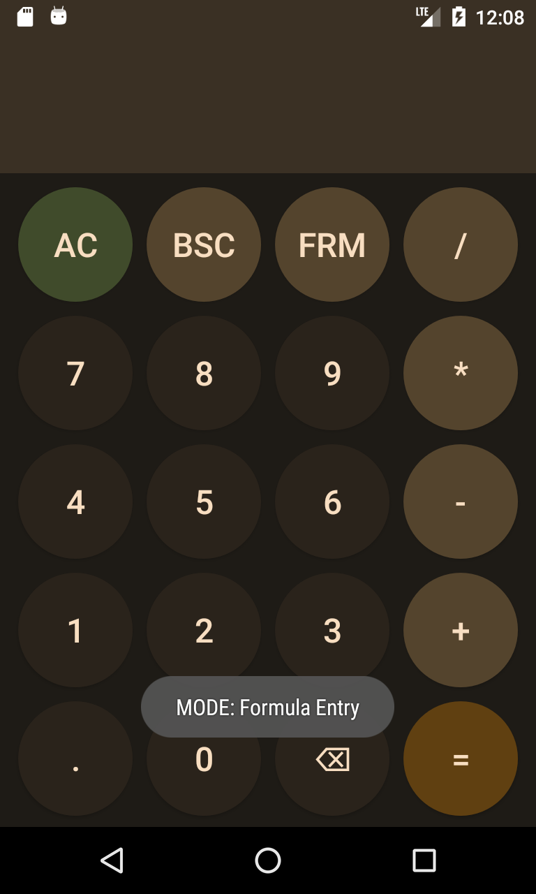
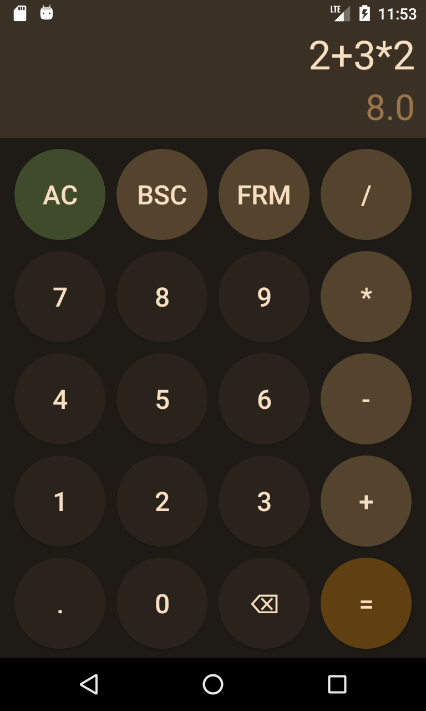
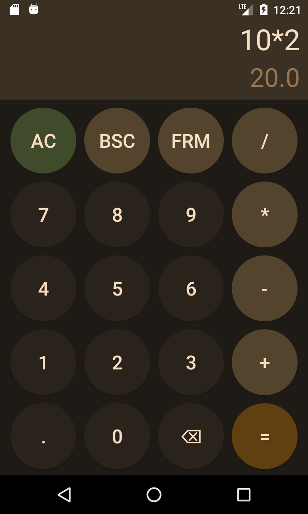
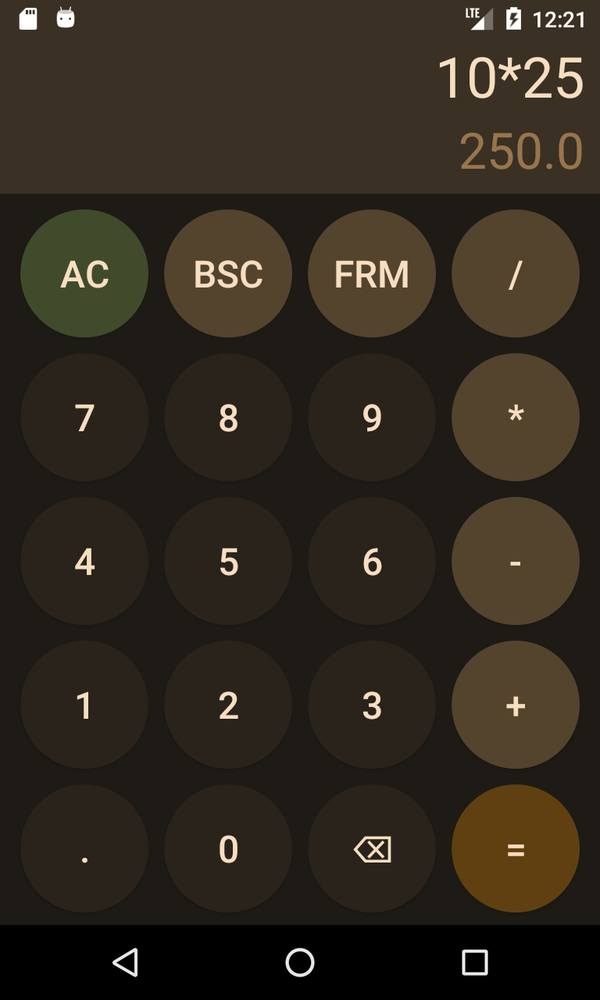
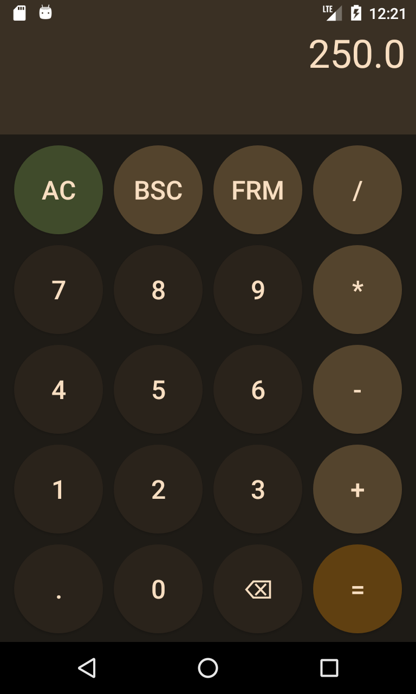

# Simple Calculator

First assignment of my Mobile Computing class, and as such is programmed following the class outline.
- A very barebones calculator programmed to do basic mathmetical calculations.
- Designed specifically on a **Nexus 4** Android Virtual Device.

## Functions & Usage Examples
To outline the most important notable functions discluding forms of any operand or operator inputs: 

### Basic Mode/Entry
- This is the default mode on app launch.
- Basic mode can be toggled by pressing the **BSC** button.
- Allows for a calculation to be computed starting from left-to-right.

    
    

### Formula Mode/Entry
- Needs to be toggled on app launch. 
- Formula mode can be toggled by pressing the **FRM** button. 
- Allows for calculations to be computing using standard order-of-operations.
- This is what most (if not all) calculators use.

    
    

### Input-Responsive Output
- The second row serves to produce the predicted outcome of the current mathematical expression based on current input mode (basic/formula). 
- The following example demonstrates that entering a number into the expression will simply compute a new predicted outcome in the second row. 
- Pressing **(=)** button will produce the result in the first row and is able to be used for the next computation. 

    
    
    

## References & Libararies
- [mXParser](https://mathparser.org/) (JDK 11) - external library used to evaluate math expressions using order-of-operations; implemented into formula mode/entry.
- [Adobe Express Logo Maker](https://www.adobe.com/express/create/logo) - used to generate a quick and basic app icon. 
- Design aspects such as the button layout and color scheme are all inspired from my Pixel 6 built-in Calculator that uses the same accent colors. 

## License
Distributed under the GNU GPLv3 License. See `LICENSE.txt` for more information.
